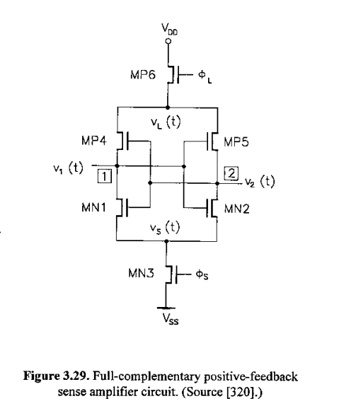

# Design Proposal

## **Specifications**

Differential Amplifier Configuration: Referring to Sedra & Smith 7th edition Fig. 16-20

| Specification | Target Value |
| ----- | ----- |
| Gain | 46 dB |
| Gain Bandwidth | \> 66MHz |
| Sensitivity | ? |
| Power Consumption | 2 mW |
| Rise Time | 15ns |
| Fall Time | 15ns |
| Operating Voltage | 1.8V |
| Transistor Count | \6~10 |

The target values for  gain and power consumption are mainly based on result values from previous research done on differential sense amplifiers. These research are done mostly using 180nm manufacturing technologies. We believe this means with the Skywater 130 manufacturing technique we can ideally get similar performances. 
The target gain bandwidth, rise and fall times are chosen to be the maximum frequency of the clock signal a TT chip can generate. 
A wide gain bandwith seems easily achievable with some studies achieving 1 GHz, since the TT clock only goes up to 66 MHz, we have set that as our target.
Studies have been able to achieve ~200ps for rise and fall times. We're not sure about need for rise and fall times that fast so we again set it tentatively as 1s/66Mhz = ~15ns even though we will likely not using the full speed of the TT clock in the end.
We have found some studies that used additional transitors to improve the performance of the amplifier but more research is needed to find a tradeoff between performance and space.
We're still not sure about the sensivitiy since it's based on the noise, gain and offset and we are not completely sure what those values would be yet.

## **Responsibility & Timeline**

Harry:
- Calculate circuit parameters based on target values

Benjamin:
- Simulating circuit in SPICE

Both:
- Resarch/prototyping differential amplifying and circuit layout

Timeline:
Finish SPICE simulations by Oct 8 
Prototype circuit by Oct 17
Testing finished by Oct 31
Finalize Design by Nov 7

## **Schematic**

## **References**

[https://skywater-pdk.readthedocs.io/en/main/rules/device-details.html](https://skywater-pdk.readthedocs.io/en/main/rules/device-details.html)  
[https://journal.esrgroups.org/jes/article/download/4626/3437/8483](https://journal.esrgroups.org/jes/article/download/4626/3437/8483)  
[https://escholarship.org/content/qt0xn2r2wx/qt0xn2r2wx\_noSplash\_78b1af6aa1f3f19975d8ea05d02b6c16.pdf](https://escholarship.org/content/qt0xn2r2wx/qt0xn2r2wx_noSplash_78b1af6aa1f3f19975d8ea05d02b6c16.pdf)  
[https://ieeexplore.ieee.org/stamp/stamp.jsp?tp=\&arnumber=7307846](https://ieeexplore.ieee.org/stamp/stamp.jsp?tp=&arnumber=7307846)  
[https://ieeexplore.ieee.org/stamp/stamp.jsp?tp=\&arnumber=4766682](https://ieeexplore.ieee.org/stamp/stamp.jsp?tp=&arnumber=4766682)  
[https://ieeexplore.ieee.org/stamp/stamp.jsp?tp=\&arnumber=8822122](https://ieeexplore.ieee.org/stamp/stamp.jsp?tp=&arnumber=8822122)  
[https://repositories.lib.utexas.edu/server/api/core/bitstreams/3471b6ba-65ba-40c2-82be-2238615c11e1/content](https://repositories.lib.utexas.edu/server/api/core/bitstreams/3471b6ba-65ba-40c2-82be-2238615c11e1/content)  
[https://ieeexplore.ieee.org/stamp/stamp.jsp?tp=\&arnumber=9177098](https://ieeexplore.ieee.org/stamp/stamp.jsp?tp=&arnumber=9177098)  
[https://tinytapeout.com/specs/clock/](https://tinytapeout.com/specs/clock/)
