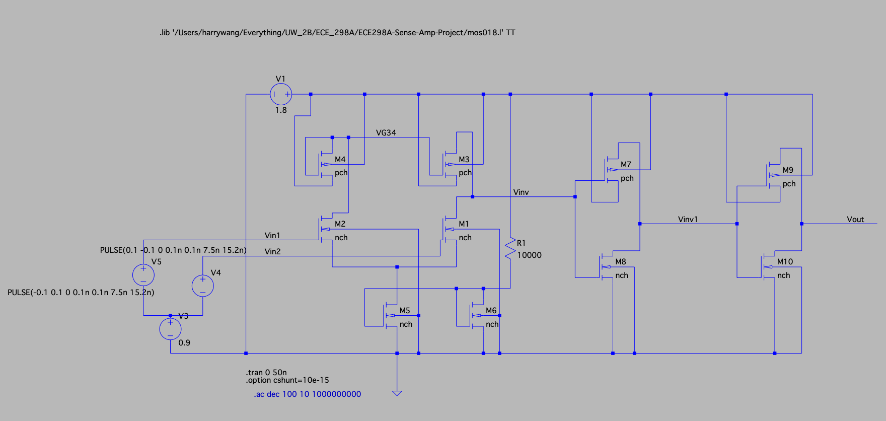
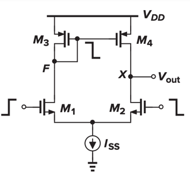
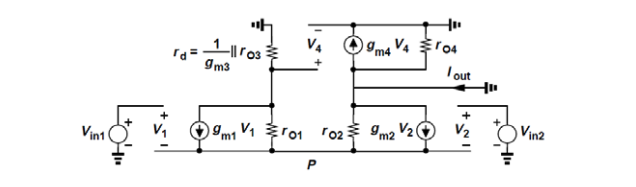
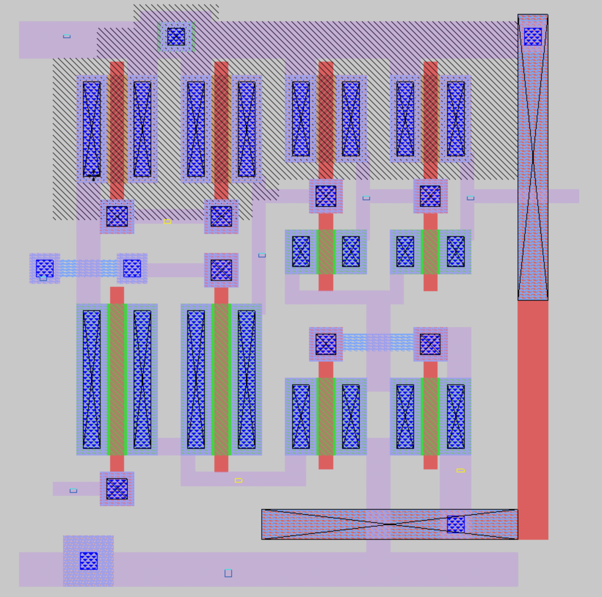
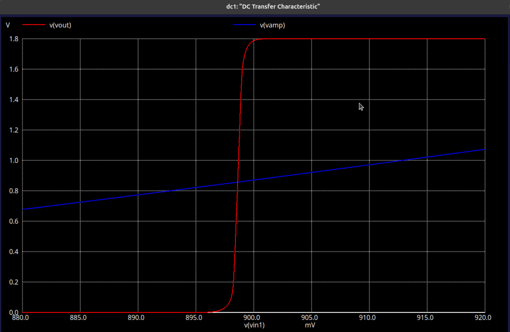
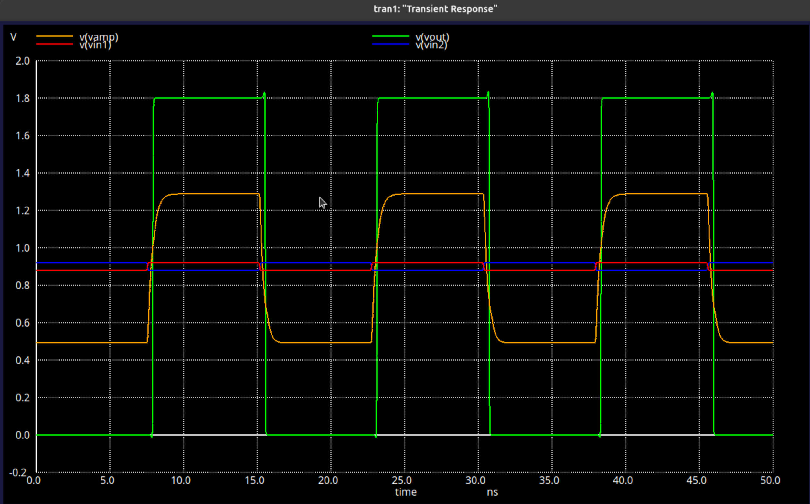
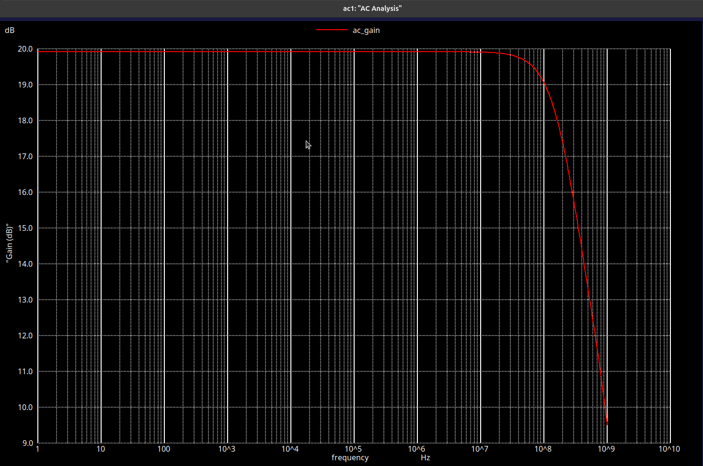

## Design Document

### Circuit Design

This is a continuous-time differential amplifier for sensing RAM bitlines. It take a tiny voltage difference on the bitlines and amplify it to a full-scale signal (0-1.8V) that the rest of the system can use. Our initial design was using the latched sense amp but then we eventually went with continuous-time operation because our architecture needs to monitor the bitline voltage throughout the read cycle, not just capture it at one clock edge.

The circuit has three parts:

**Current Source**: 2 NMOS transistors keeps the sum of the total current across the two branches fixed and keeps them in saturation so they don't drift around when the common-mode voltage changes.

**Difference Amplifier**: 


*Differential Amplifier, source: https://electronics.stackexchange.com/questions/542529/differential-pair-active-load-contradiction*

*Small signal analysis, source: https://www.seas.ucla.edu/brweb/teaching/215A_F2014/diffmir2.pdf*

All the MOSFETS are biased to saturation. The current mirror forces the two branch's current to be identical.
Looking at the small signal model, a difference in voltage on the differential inputs creates a conflict in current flow through the two NMOS. This results in a final output current proportional to $g_m \times V_{diff}$ at the output node. Combined with a high enough output resistance, we get an amplification affect on $\frac{V_{out}}{V_{in1} - V_{in2}}$

**Output buffers**: It is implemented by two CMOS inverters that take the amplified signal and drive it to full scaled digital output.

#### Iteration 1
We finsihed the the design proposal by Oct 8 and created a rough circuit in LTSpice. At this point it was just the basic differential pair with two NMOS inputs and PMOS loads. The simulation showed it could amplify the voltage difference, but the numbers were all over the place depending on what values we picked for the length and width for the transistors. 

#### Iteration 2
We spent the next few weeks (up to Oct 29) figuring out transistor dimensions. We started with minimum sizes and gradually increased the size. After a lot of experiements. We ended up around W/L = 1μm/0.18μm for PMOS, 1.2μm/0.18μm for NMOS inputs.

#### Iteration 3
Before Nov 5 we did final LTSpice simulation. Measured gain (around 36dB), sensitivity (could detect 10mV differential). Then we started the Magic VLSI layout.

### Layout in Magic VLSI:
#### Iteration 1
By Nov 13 we had a working differential amplifier in Magic. We learned to draw the transistors, extracted the design, ran ngspice, and the input signal can be amplified. Problem was the amplifier's output was still not in full scaled analog. During the Nov 13 lecture we found out we needed a buffer on the output to achieve that.

#### Iteration 2
Next week (before Nov 20) we added the buffer stage by adding two CMOS inverter at first. Output swing reached 0V to 1.8V. But the switching point of the inverter was too low, we tried with a voltage divider to bias the first inverter, which worked but was obviously not a good solution. Also we noticed the amplifier cannot work above 10MHz. After the lecture, we learned that we can replace our voltage source with a current mirror to set the bias correctly.

#### Iteration 3
Dec 1 lecture, we were told our voltage divider and current mirror are not implemented correctly. 

There were 2 issues\:
1 - We were biasing the first output inverter with an voltage divider. We realized just by sizing the PMOS/NMOS pair we were able to get similar results.
2 - We were using the voltage divider as a tail bias supply, this was not needed by simply adding a resistor and sizing the cmos appropriately, we can get sufficient tail current.

This version finally worked correctly and gave use desired behaviors for both gain, bias and speed

#### Transistor sizing

We have 3 main goals in terms of transistor sizing:
- minimize size
- minimize power consumption
- maximizing bandwidth

We first used LTSpice to simulate sizing before implementing the design in magic and used ngspice for final testing on the components

We initially tried to maximize the gain of the amplifier, but that reduced the bandwidth. 
After learning that the differential input from the bitline would already be fairly high, and that we will be feeding the final output through a CMOS buffer. We increased the tail current to improve the bandwidth of the amplifier 

We set the Length of all the transistors to be the minimum allowed by DRC.
For the PMOS pair, the width affect the Vout's bias, we experimented with width such that the output swings are centered around 0.9V given 0.9V at the inputs
For the input NMOS, a higher width increased the transconductance and improves the speed of the amplifier, thus we selected highest values possible that fit within our footprint
For the back-to-back inverters, higher Widths allows for better rise and fall speeds, but Wn/Wp also affected the switching point of the inverteres. So we selected highest widths possible given our footprint and experimented to find Wn/Wp that switches at 0.9V 

#### Tail Voltage Calculations:
$$\frac{V_{DD} - V_G}{R} = \left[ \frac{1}{2} k_n (V_G - V_{th})^2 \right]$$

$$\frac{R k_n}{2} V_G^2 + (1 - R k_n V_{th})V_G + \left(\frac{R k_n}{2} V_{th}^2 - V_{DD}\right) = 0$$

$$V_G = \frac{-(1 - R k_n V_{th}) \pm \sqrt{(1 - R k_n V_{th})^2 - 4\left(\frac{R k_n}{2}\right)\left(\frac{R k_n}{2} V_{th}^2 - V_{DD}\right)}}{R k_n}$$

$R_{sheet} = 2000 \Omega, \quad R = R_{sheet} \times W/L$

### Final Design:


### Testing:
We used ngspice to test the extracted spice files from magic

We included all parasitic capacitances:
```
extract all
ext2spice subckt top
ext2spice cthresh 0 
ext2spice
```

We used 3 types of tests:

- DC Sweep to find the operating points of the circuit

- Transient analysis at 66MHz (TinyTapeout max speed) to find the rise/fall times and runtime power disspation

- AC Analysis to find the gain and bandwidth of the amplifier

| Specification | Method |
| ----- | ----- |
| Gain | AC Sweep |
| Gain Bandwidth |  AC Sweep |
| Switching Point | AC Sweep |
| Sensitivity | DC sweep |
| Avg Consumption |  Transient analysis|
| Rise Time | Transient Analysis |
| Fall Time | Transient Analysis |
| Delay Time | Transient Analysis |


### Test Results




| Specification | Tested Value |
| ----- | ----- |
| DC Gain | 19.918 dB |
| Bandwidth | 3dB at 223.04 MHz |
| Switching Point | 0.8986 V |
| Sensitivity | 1.451 mV |
| Avg Consumption | 183.96 uW |
| Rise Time | 76.38ps |
| Fall Time | 65.69ps |
| Delay Time (@66MHZ) | 527.27 ps |
| Operating Voltage | 1.8V |
| Transistor Count | 10 |
| Layout footprint | 6.64 x 6.92 microns |

### Final Optimizations

During the final phases of the design, we tried to optimize the footprint and power consumption.

#### Resistor for tail current mirror
We considered removing the resistor for the tail current source to increase bandwidth and reduce footprint - as resistors in magic require more clearance than other components. We eventually decided to keep the resistor after realizing the total current would drastically increase without the resistor, and we already have enough bandwidth for TT's max clock speed

#### Additional footprint reduction
When verifying our final design for DRC, we realized we overlooked a space optimization that allows us to drastically reduce the length of the MOSFETS from around 0.4um to 0.16um. This further improved our bandwidth.

#### Transistor Width adjustments
We initially based the sizing on LTspice simulation, and at the end we further  tweaked the sizing of the current mirror and output buffer to try and bias the output of the differential amplifier and the switching point of the inverterse to exactly 0.9V 